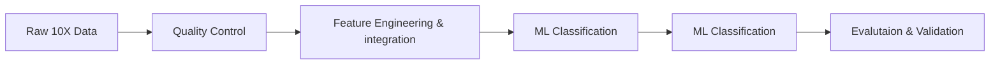

# scATAC-TF: Machine Learning Framework for Cell Type Classification

<div align="center">
  

</div>

## Overview

A comprehensive machine learning pipeline for single-cell chromatin accessibility (scATAC-seq) data analysis, focusing on accurate cell type classification using transcription factor (TF) activity profiles.

### Key Innovation
Instead of the traditional approach of identifying TFs from open chromatin regions, our framework leverages known TF motifs to predict cell-type-specific regulatory activity, enabling systematic discovery of regulatory programs and therapeutic targets.

---

## Quick Start

### Prerequisites
- **Python**: 3.8-3.11 (recommended: 3.10)
- **R**: 4.2 or higher
- **Memory**: 16GB RAM minimum (32GB recommended)
- **Storage**: 5GB free space

---------------------------------

### Usage

```bash
# 1. Process RNA data (Team 1)
Rscript team1_rna_processing.R

# 2. Process ATAC data (Team 2) 
Rscript team2_atac_processing.R

# 3. Run ML classification
python ml_pipeline.py
```

---

## Methodology

### Data Processing Pipeline



### Step-by-Step Workflow

#### Phase 1: Data Preprocessing (R)
1. **Quality Control**: Remove low-quality cells, doublets, and mitochondrial genes
2. **Cell Annotation**: Automated cell type identification using SingleR
3. **Feature Selection**: Extract top 2000 variable genes and 5000 accessible peaks
4. **Data Integration**: Combine RNA and ATAC modalities

#### Phase 2: Machine Learning (Python)
1. **Imbalance Analysis**: Detect and correct class imbalances using SMOTE
2. **Feature Engineering**: Dimensionality reduction and feature selection
3. **Model Training**: Train Random Forest, XGBoost, and SVM classifiers
4. **Evaluation**: Comprehensive performance assessment with cross-validation

#### Phase 3: Analysis & Interpretation
1. **Performance Metrics**: Accuracy, precision, recall, F1-score, AUC
2. **Biological Validation**: Compare results with known cell type markers
3. **Visualization**: Generate heatmaps, confusion matrices, and feature importance plots

---

## Dataset .....needs double checking ..

**Primary Dataset**: 10X Genomics PBMC Multiome
- **Source**: Healthy female donor (age 25)
- **Cells**: 12,016 high-quality cells
- **Cell Types**: T cells, B cells, Monocytes, NK cells
- **Features**: 63,751 ATAC peaks + 12,576 linked genes
- **Size**: ~144 GB (full dataset)

**Test Dataset**: 3K PBMC subset (~24 GB) available for initial testing

---

## Results

### Expected Performance
- **Classification Accuracy**: 96-97%
- **Processing Time**: 2-4 hours (depending on dataset size)
- **Cell Type Recovery**: >90% agreement with reference annotations

---


---

## Technical Requirements

### R Packages
```r
# Core packages
library(Seurat)         # Single-cell RNA analysis
library(Signac)         # Single-cell ATAC analysis
library(SingleR)        # Automated cell annotation
library(DoubletFinder)  # Doublet detection
```

### Python Packages ---- if any changes during installation ..please edit.. 
```python
# Essential packages
pandas>=1.3.0           # Data manipulation
scikit-learn>=1.0.0     # Machine learning
xgboost>=1.5.0          # Gradient boosting
imbalanced-learn>=0.8.0 # Class balancing
```

---

## Contributors

| Role | Contributor | Affiliation |
|------|-------------|-------------|
| **Team Lead** | Rana H. Abu-Zeid | Computational Biology & Project Management |
| **Bioinformatician** | Syrus Semawule | Data Processing & Biological Annotation |
| **ML Engineer** | Emmanuel Aroma | ML Modeling & Pipeline Control |
| **Data Analyst** | Toheeb Jumah | Manuscript Writing & Analysis |

**Advisor**: Olaitan I. Awe, ASBCB Training Officer

---

## License

This project is licensed under the MIT License - see the [LICENSE](LICENSE) file for details.

---

## Acknowledgments

- **ASBCB**: African Society for Bioinformatics and Computational Biology
- **NIH**: Office of Data Science Strategy
- **10X Genomics**: For providing open-access datasets
- **JASPAR**: For transcription factor motif databases

<div align="center">
  
**Developed during the Omics Codeathon 2025**

*Organized by ASBCB with NIH support*

</div>
